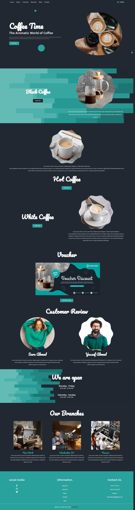

<h2 align="center">coffee web || yossef</h2>


### Description:


```
🏠Home: 🌟 Begin your immersive journey into the world of our premium coffees right here. Engage in a sensory experience that showcases our aromatic blends in an interactive and responsive layout built with state-of-the-art tech, including SaaS, JS, and HTML.

💼About Us: 🌱 Our story begins with a genuine passion for extraordinary coffee. Through this section, digitally walk through our evolution, values, and the craftsmanship that goes into every cup of coffee ☕ we serve. Our “About Us” is brought to life through clever usage of SaaS and HTML that guarantees a user-friendly experience.

👥Customers: 💖 It's all about incredible relationships with our coffee-loving community. This section serves as a testament, housing heartwarming customer testimonials, profiles of our loyal customer base, and featured stories, all in an engaging interactive visual format.

🏞️Branches: 📍 Dive into the interactive map of our branches. Navigating to your next cup of coffee has never been this easy, with each location distinctly marked with detailed profiles, brought to life with efficient utilization of JS, ensuring a smooth interface.

🛒Shop: 💻 Hop into our digital store, stocked with freshly cooled coffee beans, lovable merchandise, and top-tier coffee equipment. A brilliantly designed responsive shop, made possible through the combined power of SaaS, JS, and HTML, offering seamless navigation through our coffee portfolios.

📬Contact Us: 💌 Communication is the essence of our progression. Our contact section is designed for simplistic yet effective communication, built ergonomically using HTML to ensure your valuable feedback, suggestions, or queries reach us promptly.

The overall design of the website aims to enhance your experience by offering accessible navigation, charming aesthetics, and the optimum level of responsiveness, integrating SaaS, HTML, and JS. Our ultimate goal is to offer an exclusive digital coffee hub that you’d love to frequent as much as our coffee shops! ☕🎉💌⭐

```



### email: 
```

yossefsabry66@gmail.com

```